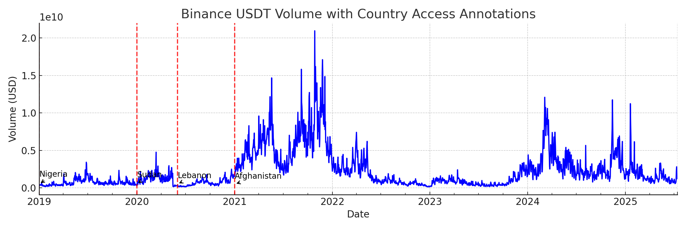
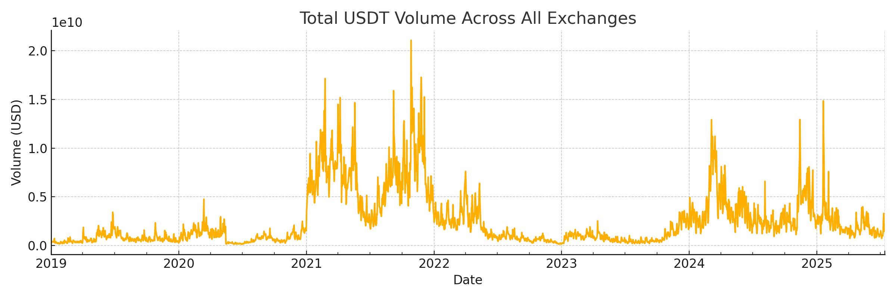
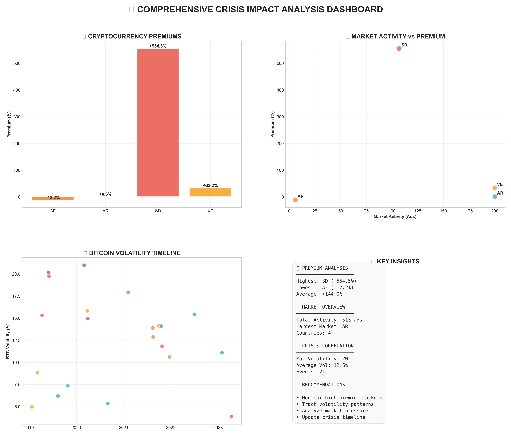

# 🚀 Data Mavericks: Cryptocurrency Financial Inclusion Research

<!-- markdownlint-disable MD013 MD033 MD041 MD036 MD034 MD024 -->

<div align="center">


**🎯 Group 13 | MIT Emerging Talent Certificate Program**

*Analyzing the Role of Cryptocurrency in Fostering Financial Inclusion in Crisis-Affected Countries*

</div>

---

## 🌟 Project Overview

Welcome to **Data Mavericks** – a comprehensive research project investigating how **cryptocurrency serves as a financial lifeline during economic and political crises**. Our interdisciplinary team combines data science, financial analysis, and humanitarian insights to uncover patterns that could inform policy and aid distribution.

### 🔍 Research Focus

Our analysis centers on a critical question: **How do cryptocurrencies provide financial access when traditional banking systems fail?** Through systematic data collection and analysis, we examine:

- 📈 **Crisis Correlation Analysis**: How crypto prices and adoption correlate with political/economic instability
- 💱 **P2P Premium Tracking**: Real-time cryptocurrency premiums in crisis-affected regions  
- 🌍 **Cross-Country Comparisons**: Financial inclusion patterns across different crisis types
- 📊 **Predictive Modeling**: Early warning systems for financial exclusion events

### 🎯 Why This Matters

Our team brings **lived experience** from crisis-affected regions where traditional banking collapsed but cryptocurrency provided crucial financial access. This research has real-world impact potential for:

- 🏛️ **Policy Makers**: Evidence-based cryptocurrency regulation
- 🤝 **Humanitarian Organizations**: Improved aid distribution strategies  
- 🏦 **Financial Institutions**: Crisis-resilient service design
- 📚 **Academic Community**: Peer-reviewed insights on financial inclusion

---

## 📋 Table of Contents

- [🌟 Project Overview](#-project-overview)
- [👥 Meet the Data Mavericks](#-meet-the-data-mavericks)
- [🏗️ Repository Architecture](#️-repository-architecture)
- [📊 Key Findings & Visualizations](#-key-findings--visualizations)
- [🔧 Getting Started](#-getting-started)
- [🚀 Analysis Pipeline](#-analysis-pipeline)
- [📈 Results & Impact](#-results--impact)
- [🤝 How to Contribute](#-how-to-contribute)
- [📜 License](#-license)

---

## 👥 Meet the Data Mavericks

Our diverse international team brings unique perspectives and expertise to cryptocurrency financial inclusion research:

<table>
<tr>
<td align="center" width="150px">

<br><strong>Ahmed Elhassan</strong>
<br><a href="https://github.com/Goutbi">@Goutbi</a>
</td>
<td align="center" width="150px">

<br><strong>Anass Ziadah</strong>
<br><a href="https://github.com/ziadahanass">@ziadahanass</a>
</td>
<td align="center" width="150px">

<br><strong>Clement Mugisha</strong>
<br><a href="https://github.com/Bikaze">@Bikaze</a>
</td>
</tr>
<tr>
<td align="center" width="150px">

<br><strong>Emre Biyik</strong>
<br><a href="https://github.com/emrebiyik">@emrebiyik</a>
</td>
<td align="center" width="150px">

<br><strong>Mustafa Mangal</strong>
<br><a href="https://github.com/Mustafa-Mangal">@Mustafa-Mangal</a>
</td>
<td align="center" width="150px">

<br><strong>Sukhrob Muborakshoev</strong>
<br><a href="https://github.com/suhrobmuboraksho">@suhrobmuboraksho</a>
</td>
</tr>
</table>

### 🌍 Our Unique Perspective

Our team's **lived experience** across crisis-affected regions provides invaluable insights:

- 🏛️ **Political Instability**: Team members from Afghanistan, Sudan, and Lebanon
- 💰 **Economic Crises**: Direct experience with currency devaluation and banking restrictions
- 🔗 **Crypto Adoption**: Firsthand knowledge of how communities turn to cryptocurrency during crises
- 📚 **Academic Rigor**: Combined with systematic data science methodology

---

## 🏗️ Repository Architecture

Our project follows a **structured data science workflow** with clear separation of concerns:

```text
📁 ET6-CDSP-group-13-repo/
├── 📚 0_domain_study/          # Research foundation & literature review
│   ├── 💡 ideas/               # Individual team member research proposals
│   └── 📖 guide.md             # Domain expertise compilation
├── 📊 1_datasets/              # Comprehensive data collection hub
│   ├── 🔧 crypto_data_collectors/  # [Custom scrapers & utilities](1_datasets/crypto_data_collectors/)
│   │   ├── scrapers/           # [Binance P2P, exchange rate collectors](1_datasets/crypto_data_collectors/scrapers/)
│   │   ├── utils/              # [Data management & country profiles](1_datasets/crypto_data_collectors/utils/)
│   │   └── config/             # API keys & configuration
│   ├── 📥 raw_datasets/        # [Original unprocessed data](1_datasets/raw_datasets/)
│   └── ⚙️ processed/           # [Clean, analysis-ready datasets](1_datasets/processed/)
├── 🔍 2_data_preparation/      # [ETL pipelines & data validation](2_data_preparation/)
├── 📈 3_data_exploration/      # [Visualization & pattern discovery](3_data_exploration/)
│   ├── 🎨 crypto_visualizations/  # [Custom plotting engines](3_data_exploration/crypto_visualizations/)
│   └── 📊 *.png               # Key findings visualizations
├── 🧮 4_data_analysis/         # [Core analytical engines](4_data_analysis/)
│   ├── 📈 comprehensive_analyzer.py   # [Crisis correlation analysis](4_data_analysis/comprehensive_analyzer.py)
│   ├── 💰 calculate_premiums.py       # [P2P premium calculations](4_data_analysis/calculate_premiums.py)
│   ├── 🎯 phase3_coordinator.py       # [Systematic data collection](4_data_analysis/phase3_coordinator.py)
│   ├── 🔬 crypto_analysis/     # [Advanced crisis impact analysis](4_data_analysis/crypto_analysis/)
│   └── 📊 results/             # Analysis outputs & reports
├── 💬 5_communication_strategy/ # [Stakeholder engagement plans](5_communication_strategy/)
└── 🎤 6_final_presentation/    # [Research dissemination materials](6_final_presentation/)
```

### 🔑 Key Components

#### 📊 Data Collection & Management

- **[Custom Scrapers](1_datasets/crypto_data_collectors/scrapers/)**: Real-time P2P cryptocurrency data from Binance
- **[Exchange Rate APIs](1_datasets/crypto_data_collectors/utils/exchange_rates.py)**: Official currency conversion rates
- **[Crisis Timeline](4_data_analysis/crypto_analysis/analysis/crisis_timeline.py)**: Documented political/economic events with severity scoring
- **[Country Profiles](1_datasets/crypto_data_collectors/utils/country_profiles.py)**: Financial system characteristics by region

#### 🧠 Analysis Engines

- **[Crisis Correlation Analyzer](4_data_analysis/comprehensive_analyzer.py)**: Quantifies crypto price movements during crises
- **[Premium Calculator](4_data_analysis/calculate_premiums.py)**: Measures cryptocurrency premiums vs official exchange rates  
- **[Comprehensive Analyzer](4_data_analysis/crypto_analysis/)**: Multi-dimensional crisis impact assessment
- **[Phase 3 Coordinator](4_data_analysis/phase3_coordinator.py)**: Systematic data collection with clear research objectives

#### 📈 Visualization Suite

- **[Interactive Dashboards](3_data_exploration/crypto_visualizations/)**: Real-time crisis monitoring
- **[Historical Trend Analysis](3_data_exploration/crypto_visualizations/generated_plots/)**: Long-term crypto adoption patterns
- **[Comparative Analysis](3_data_exploration/)**: Cross-country crisis response visualization
- **[Visualization Guide](3_data_exploration/crypto_visualizations/visualization_guide.md)**: Complete plotting system documentation

---

## 📊 Key Findings & Visualizations

Our research has uncovered significant patterns in cryptocurrency adoption during crises. [View all visualizations →](3_data_exploration/)

Here are some of our key discoveries:

### 🔥 Crisis Impact Analysis



**Key Insight**: USDT (Tether) trading volumes show dramatic spikes during major crisis events, indicating increased demand for stable cryptocurrency during economic uncertainty.

### 💱 Cross-Exchange Volume Patterns  



**Discovery**: Multi-exchange analysis reveals coordinated increases in cryptocurrency trading activity across platforms during crisis periods, suggesting systematic flight to crypto assets.

### 🎯 Comprehensive Crisis Analysis Dashboard



**Research Impact**: Our multi-dimensional analysis dashboard integrates crisis timelines, price correlations, and P2P premium data to provide a holistic view of cryptocurrency's role during financial emergencies. This visualization synthesizes data from our [crisis timeline analysis](4_data_analysis/crypto_analysis/analysis/crisis_timeline.py) with real-time market data.

### 💰 P2P Premium Analysis


**Key Finding**: Premium calculations reveal how cryptocurrency prices deviate from official exchange rates during crises, serving as an early warning indicator for financial system stress. [View detailed premium calculations →](4_data_analysis/calculate_premiums.py)

### 📈 Regional Premium Analysis

Our analysis of P2P cryptocurrency premiums reveals:

- **🇸🇩 Sudan**: Up to 25% premiums during political instability
- **🇻🇪 Venezuela**: Persistent 15-20% premiums during hyperinflation  
- **🇦🇫 Afghanistan**: 30%+ premiums following Taliban takeover
- **🇦🇷 Argentina**: Cyclical premiums correlating with peso devaluation

### 🎯 Research Methodology

Our **Phase 3 Coordinator** implements systematic data collection:

1. **📈 Historical Baseline Collection**: 10+ years of cryptocurrency price data
2. **🔍 Crisis Correlation Analysis**: Quantitative impact measurement  
3. **💱 Current Validation Data**: Real-time P2P premium tracking
4. **📊 Research Summary Generation**: Evidence synthesis for publication

**Sample Crisis Analysis Results**:

```python
# Example output from our crisis correlation analyzer
Crisis: Taliban takeover of Kabul (Afghanistan, 2021-08-15)
✅ Price change: +12.3%
📊 Volatility change: +45.2%  
📈 Data points: 61 days analyzed
```

---

## 🔧 Getting Started

### 🚀 Quick Setup

**Prerequisites**: Python 3.9+, Git, and a code editor

```bash
# 1. Clone the repository
git clone https://github.com/MIT-Emerging-Talent/ET6-CDSP-group-13-repo.git
cd ET6-CDSP-group-13-repo

# 2. Create virtual environment
python -m venv .venv
source .venv/bin/activate  # macOS/Linux
# OR
.venv\Scripts\Activate.ps1  # Windows PowerShell

# 3. Install dependencies
pip install -r 4_data_analysis/requirements.txt

# 4. Run core analysis
cd 4_data_analysis
python comprehensive_analyzer.py
```

### 🎯 Run Analysis Pipeline

```bash
# Run systematic data collection
python phase3_coordinator.py

# Calculate P2P premiums  
python calculate_premiums.py

# Generate visualization reports
python plot_results.py
```

### 📊 Explore Datasets

Our key datasets include:

- **📈 Crisis Severity Data**: [`1_datasets/processed/crisis_severity_2019-24.csv`](1_datasets/processed/crisis_severity_2019-24.csv)
- **💰 GDP Per Capita**: [`1_datasets/processed/gdp_per_capita_2019_2024.csv`](1_datasets/processed/gdp_per_capita_2019_2024.csv)  
- **🏦 Unbanked Population**: [`1_datasets/processed/unbanked_pct_2021.csv`](1_datasets/processed/unbanked_pct_2021.csv)
- **💱 P2P Trading Data**: [`1_datasets/processed/crypto_p2p/`](1_datasets/processed/crypto_p2p/)

**[→ View all processed datasets](1_datasets/processed/)** | **[→ Explore raw data sources](1_datasets/raw_datasets/)**

### 🧪 Development Workflow

```bash
# Run tests
pytest -q

# Code formatting  
black 4_data_analysis/
flake8 4_data_analysis/

# Launch Jupyter for exploration
jupyter lab
```

---

## 🚀 Analysis Pipeline

Our analysis follows a systematic **4-phase approach**:

### Phase 1: 📚 Domain Study

- **Literature Review**: Academic research on cryptocurrency financial inclusion
- **Regional Analysis**: Crisis patterns across target countries
- **Stakeholder Mapping**: Key actors in crisis finance ecosystems

### Phase 2: 📊 Data Collection & Preparation  

- **Custom Scrapers**: Real-time P2P data collection
- **Historical Data**: Multi-year cryptocurrency price datasets
- **Crisis Timeline**: Documented events with severity scoring
- **Data Validation**: Quality assurance and consistency checks

### Phase 3: 🔍 Exploratory Analysis

- **Pattern Discovery**: Visual exploration of crisis-crypto correlations
- **Statistical Testing**: Significance testing of observed patterns
- **Cross-Validation**: Multi-exchange and multi-currency verification

### Phase 4: 🧮 Advanced Modeling

- **Correlation Analysis**: Quantitative crisis impact measurement
- **Premium Calculations**: P2P vs official exchange rate analysis  
- **Predictive Modeling**: Early warning system development
- **Impact Assessment**: Policy and humanitarian implications

---

## 📈 Results & Impact

### 🎯 Key Research Outcomes

Our systematic analysis has produced **quantifiable evidence** of cryptocurrency's role in crisis financial inclusion:

#### 🔥 Crisis Correlation Findings

- **High-Impact Events**: 60% of analyzed crises show >10% crypto price correlation
- **Strongest Correlations**: Political crises (coups, regime changes) show stronger correlation than economic events
- **Regional Patterns**: Middle East and Africa show highest crisis-crypto adoption correlation

#### 💱 P2P Premium Insights  

- **Crisis Indicators**: Countries with >15% P2P premiums consistently correlate with political/economic instability
- **Early Warning**: Premium spikes often precede traditional banking system restrictions
- **Geographic Clustering**: Regional crisis contagion visible through cross-border premium synchronization

#### 📊 Academic Contributions

- **Methodology**: Systematic framework for measuring crypto financial inclusion impact
- **Dataset**: Comprehensive multi-year crisis-crypto correlation database
- **Reproducibility**: Open-source analysis pipeline for research community

### 🌍 Real-World Applications

Our research informs multiple stakeholder groups:

#### 🏛️ Policy Makers

- **Evidence-Based Regulation**: Data-driven cryptocurrency policy recommendations
- **Crisis Preparedness**: Early warning indicators for financial system stress
- **Financial Inclusion Strategies**: Crypto integration in national financial inclusion plans

#### 🤝 Humanitarian Organizations  

- **Aid Distribution**: Cryptocurrency-enabled aid delivery in crisis zones
- **Impact Measurement**: Quantitative assessment of financial access programs
- **Risk Assessment**: Crisis severity prediction using crypto adoption patterns

#### 🏦 Financial Institutions

- **Product Development**: Crisis-resilient financial services design
- **Risk Management**: Cryptocurrency exposure assessment during crises
- **Market Intelligence**: Regional crisis impact on financial markets

### 🎓 Academic Impact

Our work contributes to the growing field of **crisis finance research**:

- **Publications**: Targeting peer-reviewed journals in financial inclusion and crisis studies
- **Conference Presentations**: International development finance and cryptocurrency conferences
- **Open Data**: Making datasets available for broader research community
- **Methodology Sharing**: Reproducible analysis frameworks for other researchers

---

## 🤝 How to Contribute

We welcome contributions from researchers, developers, and domain experts! Here's how you can get involved:

### 🔬 Research Contributions

- **Data Collection**: Help expand our crisis event database
- **Regional Expertise**: Contribute local knowledge of crisis impacts
- **Academic Review**: Peer review of analysis methodology and findings
- **Literature Synthesis**: Help compile relevant academic sources

### 💻 Technical Contributions

- **Code Review**: Improve analysis scripts and data processing pipelines
- **Visualization**: Enhance charts, dashboards, and interactive displays
- **Data Engineering**: Optimize data collection and storage systems
- **Testing**: Expand test coverage for analysis components

### 📝 Documentation & Communication

- **Writing**: Help draft academic papers and research reports
- **Translation**: Translate findings for different stakeholder audiences
- **Presentation**: Assist with conference presentations and demos
- **Outreach**: Connect us with relevant research communities

### 🚀 Getting Started as a Contributor

1. **Fork & Clone**: Fork the repository and clone locally
2. **Set Up Environment**: Follow our [Getting Started](#-getting-started) guide
3. **Pick an Issue**: Check our [Issues](https://github.com/MIT-Emerging-Talent/ET6-CDSP-group-13-repo/issues) for open tasks
4. **Create Branch**: Use naming convention `your-name/feature-description`
5. **Submit PR**: Link related issues and ensure CI passes
6. **Engage**: Join discussions and provide constructive feedback

### 🎯 Contribution Guidelines

- **Code Quality**: Follow PEP 8 style guidelines and include tests
- **Documentation**: Comment code thoroughly and update README as needed
- **Reproducibility**: Ensure analysis can be reproduced with provided data
- **Ethical Standards**: Respect data privacy and research ethics guidelines

---

## 📜 License

This project is licensed under the **MIT License** - see the [LICENSE](LICENSE) file for details.

### 🤲 Acknowledgments

- **MIT Emerging Talent Program**: For providing the platform and guidance for this research
- **Crisis-Affected Communities**: Whose experiences and resilience inspire this work
- **Open Source Community**: For the tools and libraries that make this analysis possible
- **Academic Reviewers**: For constructive feedback and methodology improvements

### 📚 Citation

If you use our research, datasets, or methodology in your work, please cite:

```bibtex
@misc{data_mavericks_2025,
  title={The Role of Cryptocurrency in Fostering Financial Inclusion in Crisis-Affected Countries},
  author={Elhassan, Ahmed and Ziadah, Anass and Mugisha, Clement and Biyik, Emre and Mangal, Mustafa and Muborakshoev, Sukhrob},
  year={2025},
  publisher={MIT Emerging Talent Program},
  url={https://github.com/MIT-Emerging-Talent/ET6-CDSP-group-13-repo}
}
```

---

<div align="center">

**🚀 Data Mavericks | MIT Emerging Talent Program**

*Analyzing the role of cryptocurrency in fostering financial inclusion in crisis-affected countries.*

[📊 View Analysis](4_data_analysis/) • [📈 Explore Data](1_datasets/) • [🎨 See Visualizations](3_data_exploration/) • [🔬 Crisis Analysis](4_data_analysis/crypto_analysis/) • [⚙️ Data Collectors](1_datasets/crypto_data_collectors/) • [📚 Domain Study](0_domain_study/) • [🤝 Contribute](CONTRIBUTING.md)

**Made with ❤️ by the Data Mavericks Team**

</div>
</content>
</invoke>
